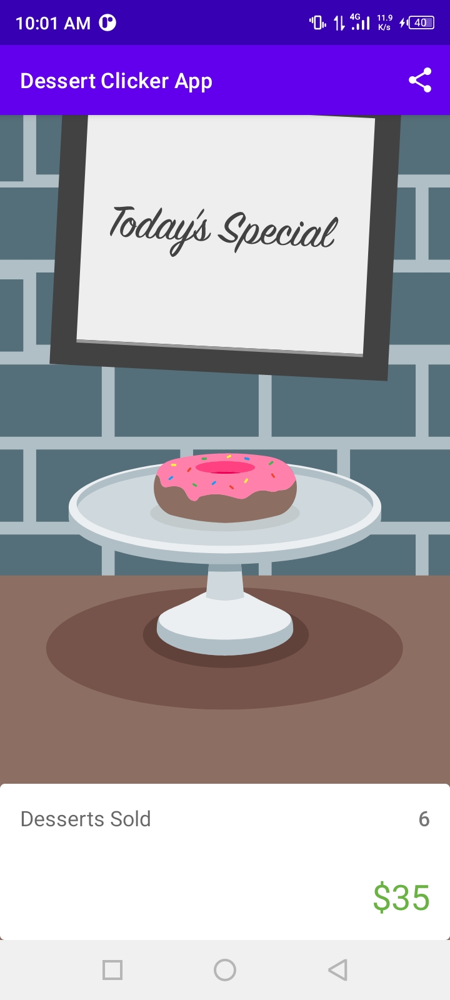
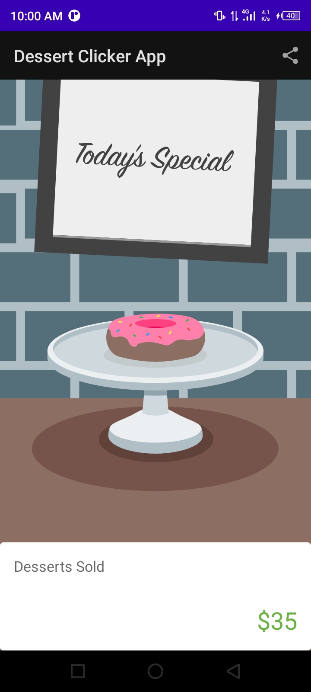

# Dessert Clicker App

A demonstration on how android lifecycle works.

## Tutorial Source

[https://developer.android.com/courses/pathways/android-basics-kotlin-unit-3-pathway-3](https://developer.android.com/courses/pathways/android-basics-kotlin-unit-3-pathway-3)

## Screenshots

<table>
    <tr>
        <td>
            <figure>
                
            </figure>
        </td>
        <td>
            <figure>
                
            </figure>
        </td>
    </tr>
</table>