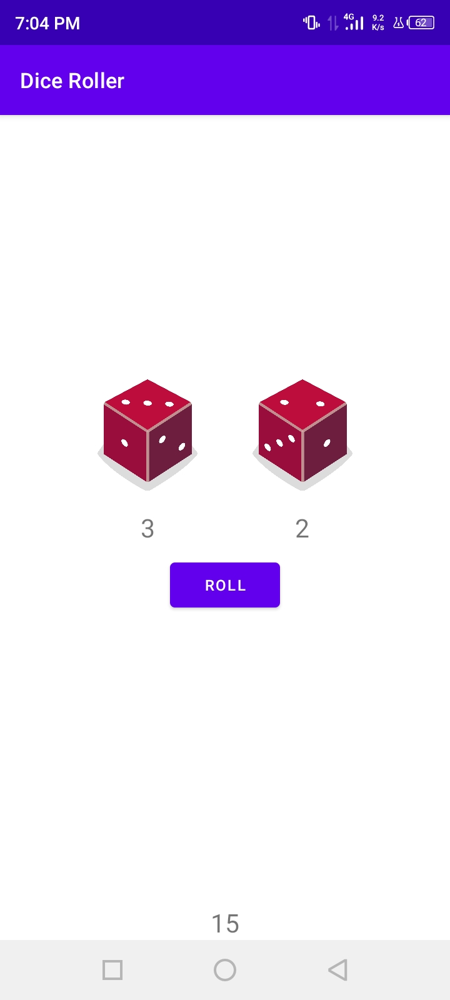
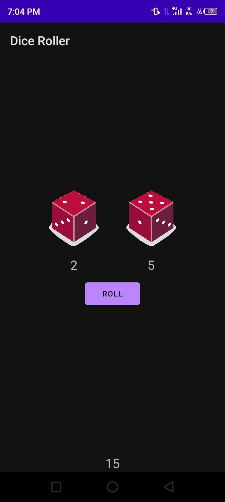

# DiceRoller

A tutorial app that teaches how to add button.

## Tutorial Source

[https://developer.android.com/courses/pathways/android-basics-kotlin-four](https://developer.android.com/courses/pathways/android-basics-kotlin-four)

## Screenshots

<table>
    <tr>
        <td>
            <figure>
                
                <figure-caption>Dice Roller</figure-caption>
            </figure>
        </td>
        <td>
            <figure>
                
                <figure-caption>Dice Roller Night</figure-caption>
            </figure>
        </td>
    </tr>
</table>