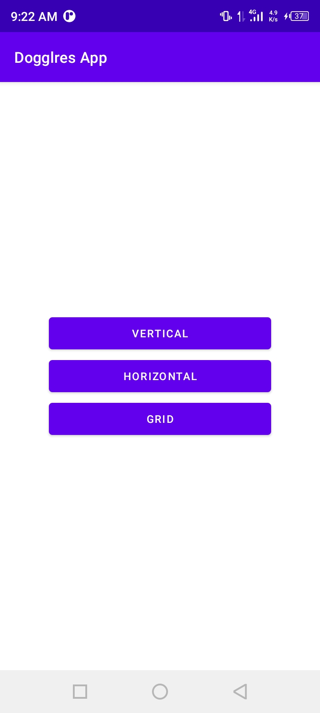
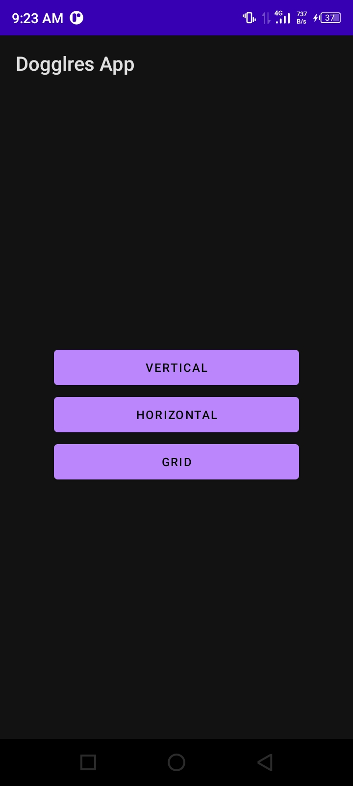
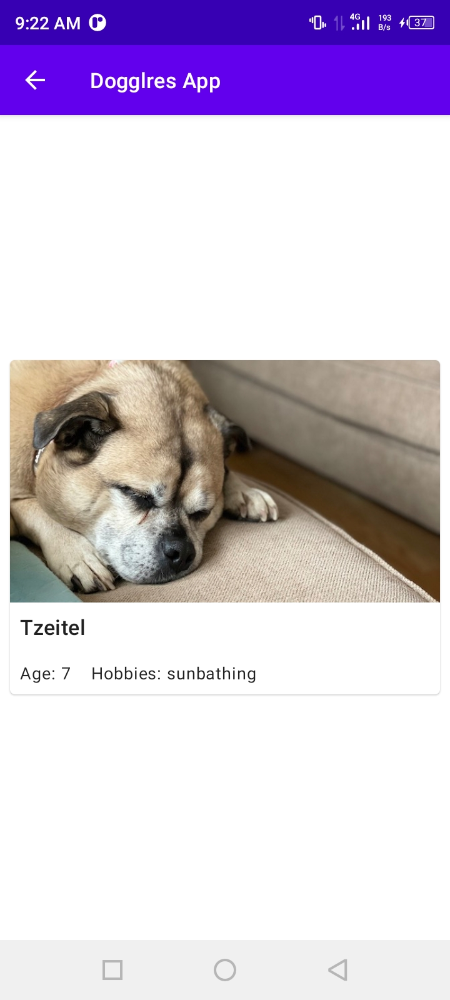
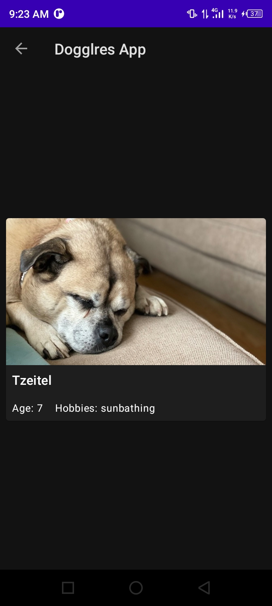
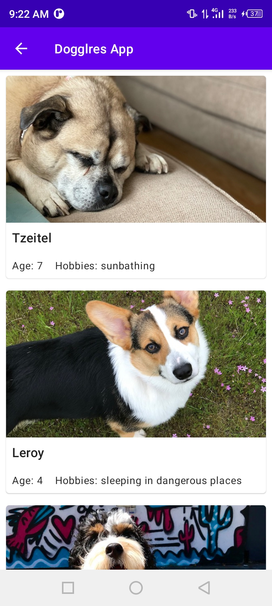
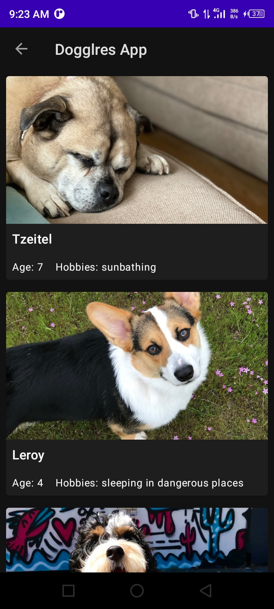
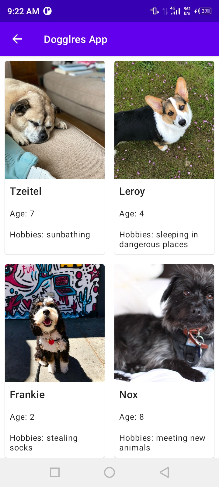
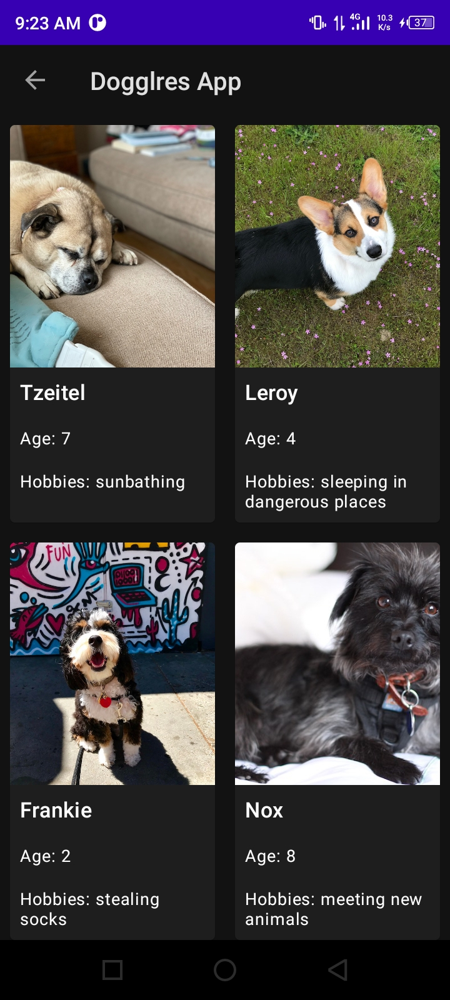

# Dogglres App

An app that shows different kind of list, e.g VerticalList, HorizontalList, GridList,...

## Tutorial Source

[https://developer.android.com/courses/pathways/android-basics-kotlin-unit-2-pathway-3](https://developer.android.com/courses/pathways/android-basics-kotlin-unit-2-pathway-3)

## Screenshots

<table>
    <tr>
        <td>
            <figure>
                
                <figure-caption>Main</figure-caption>
            </figure>
        </td>
        <td>
            <figure>
                
                <figure-caption>Main Night</figure-caption>
            </figure>
        </td>
    </tr>
    <tr>
        <td>
            <figure>
                
                <figure-caption>Horizontal</figure-caption>
            </figure>
        </td>
        <td>
            <figure>
                
                <figure-caption>Horizontal Night</figure-caption>
            </figure>
        </td>
    </tr>
    <tr>
        <td>
            <figure>
                
                <figure-caption>Vertical</figure-caption>
            </figure>
        </td>
        <td>
            <figure>
                
                <figure-caption>Vertical Night</figure-caption>
            </figure>
        </td>
    </tr>
    <tr>
        <td>
            <figure>
                
                <figure-caption>Grid</figure-caption>
            </figure>
        </td>
        <td>
            <figure>
                
                <figure-caption>Grid Night</figure-caption>
            </figure>
        </td>
    </tr>
</table>