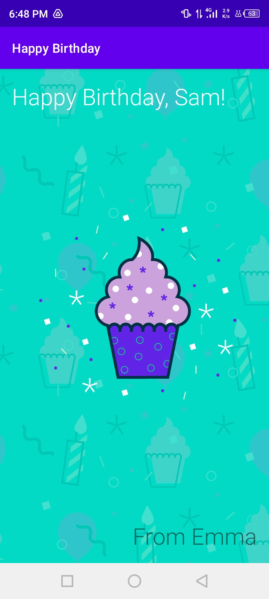
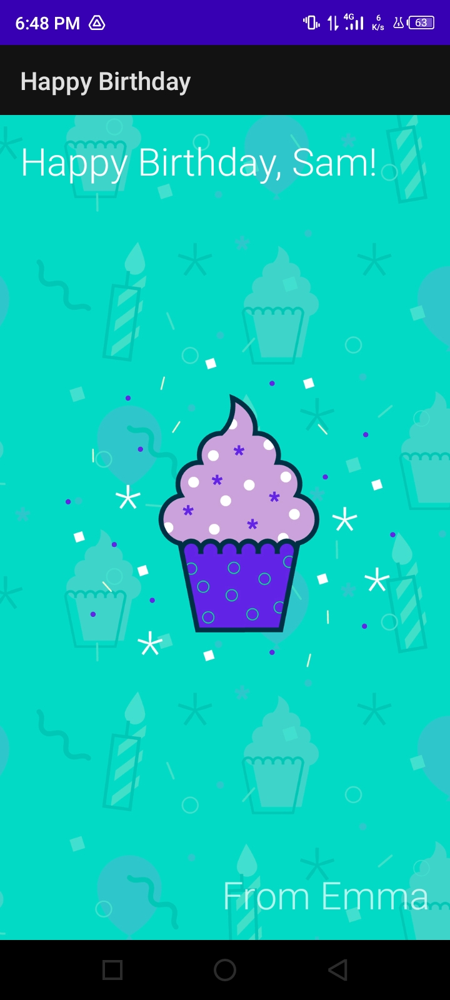

# Happy_Birthday
Simple app to introduce layout in android.

## Tutorial Source
[https://developer.android.com/courses/pathways/android-basics-kotlin-one](https://developer.android.com/courses/pathways/android-basics-kotlin-one)

## Screenshots

<table>
    <tr>
        <td>
            <figure>
                
                <figure-caption>HBD</figure-caption>
            </figure>
        </td>
        <td>
            <figure>
                
                <figure-caption>HBD Night</figure-caption>
            </figure>
        </td>
    </tr>
</table>