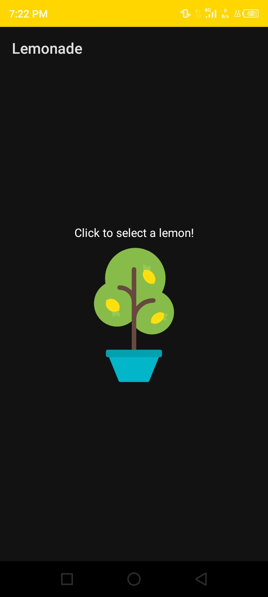

# Lemonade App

A demonstration on how button click works in android.

## Tutorial Source

[https://developer.android.com/courses/pathways/android-basics-kotlin-four](https://developer.android.com/courses/pathways/android-basics-kotlin-four)

## Screenshots

<table>
    <tr>
        <td>
            <figure>
                
                <figure-caption>Lemonade</figure-caption>
            </figure>
        </td>
        <td>
            <figure>
                
                <figure-caption>Lemonade Night</figure-caption>
            </figure>
        </td>
    </tr>
1   <tr>
        <td>
            <figure>
                
                <figure-caption>Lemonade 2</figure-caption>
            </figure>
        </td>
        <td>
            <figure>
                
                <figure-caption>Lemonade Night 2</figure-caption>
            </figure>
        </td>
    </tr>
    <tr>
        <td>
            <figure>
                
                <figure-caption>Lemonade 3</figure-caption>
            </figure>
        </td>
        <td>
            <figure>
                
                <figure-caption>Lemonade Night 3</figure-caption>
            </figure>
        </td>
    </tr>
    <tr>
        <td>
            <figure>
                
                <figure-caption>Lemonade 4</figure-caption>
            </figure>
        </td>
        <td>
            <figure>
                
                <figure-caption>Lemonade Night 4</figure-caption>
            </figure>
        </td>
    </tr>
</table>