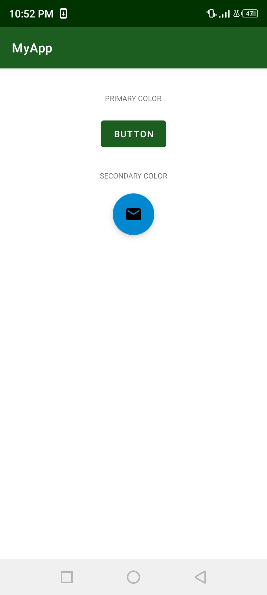
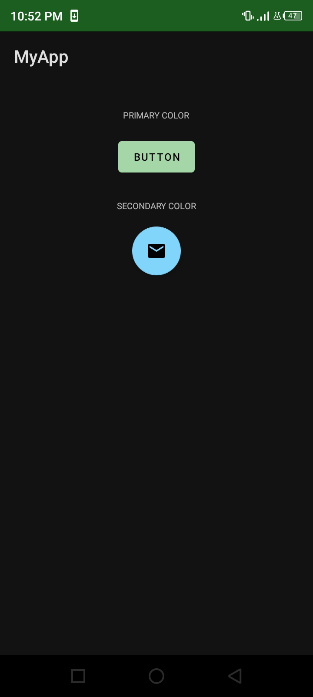

# MyApp
A demonstration app for modifying app themes.

## Tutorial Source
[https://developer.android.com/courses/pathways/android-basics-kotlin-unit-2-pathway-2](https://developer.android.com/courses/pathways/android-basics-kotlin-unit-2-pathway-2)

## Screenshots

<table>
    <tr>
        <td>
            <figure>
                
            </figure>
        </td>
        <td>
            <figure>
                
            </figure>
        </td>
    </tr>
</table>