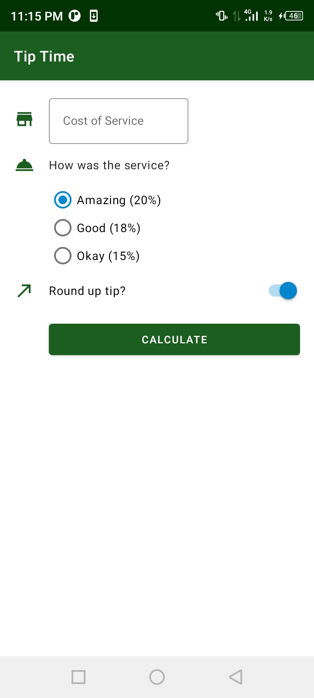
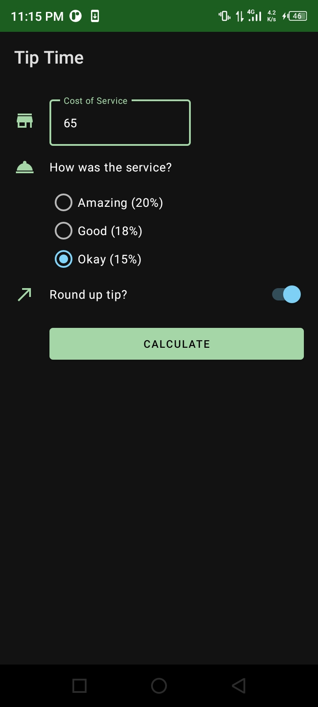
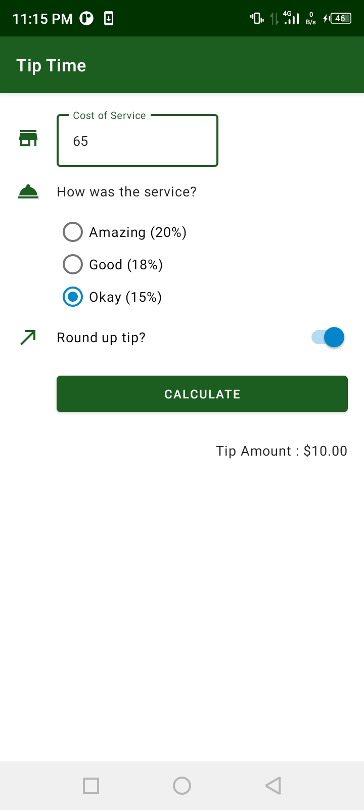
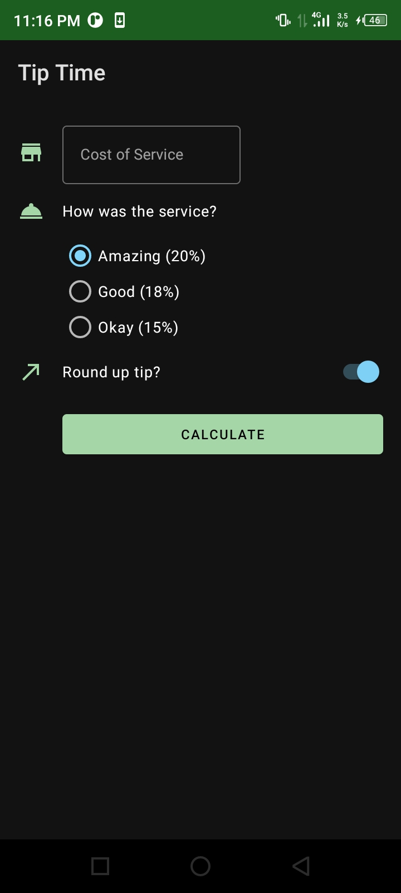

# Tip Time
Learn on how to get user input with material EditText with making a Tip Time app as the practice.

## Tutorial Source
[https://developer.android.com/courses/pathways/android-basics-kotlin-unit-2-pathway-1](https://developer.android.com/courses/pathways/android-basics-kotlin-unit-2-pathway-1)

## Screenshots
<table>
    <tr>
        <td>
            <figure>
                
            </figure>
        </td>
        <td>
            <figure>
                
            </figure>
        </td>
    </tr>
    <tr>
        <td>
            <figure>
                
            </figure>
        </td>
        <td>
            <figure>
                
            </figure>
        </td>
    </tr>
</table>