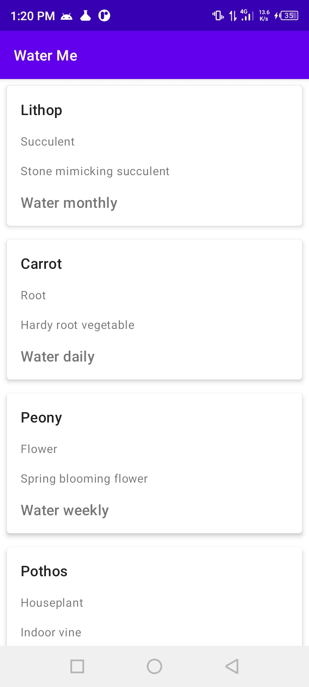
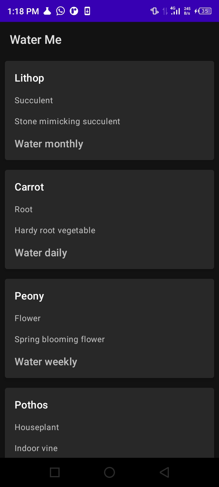
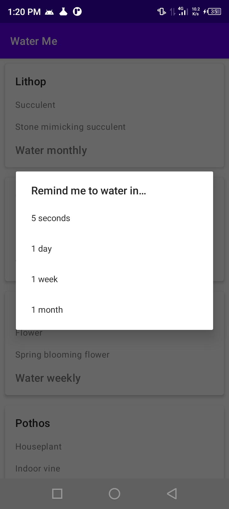
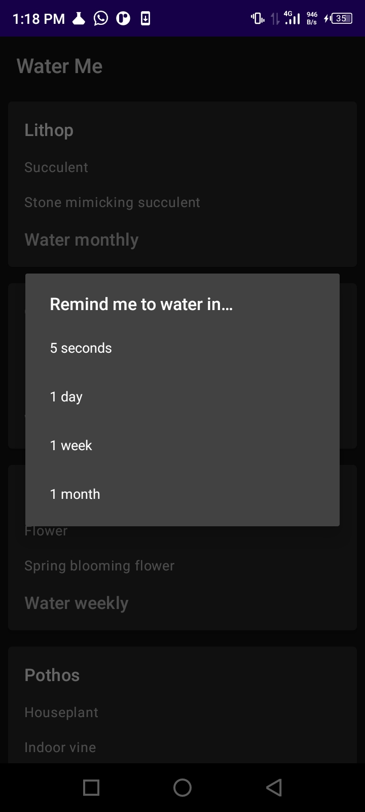
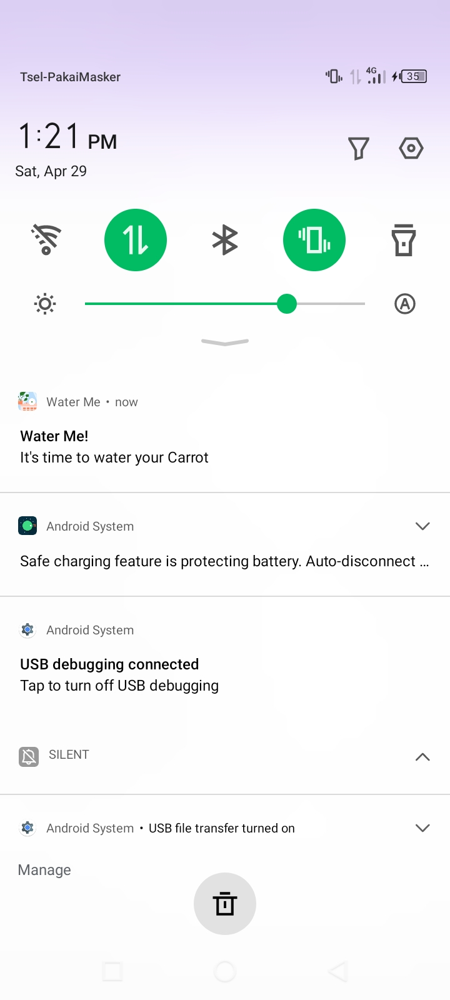
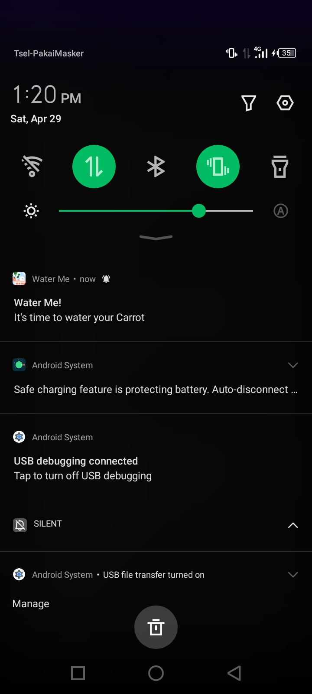

# Water Me

A demonstration on how WorkManager API works.

## Tutorial Source

[https://developer.android.com/courses/pathways/android-basics-kotlin-unit-6-pathway-1](https://developer.android.com/courses/pathways/android-basics-kotlin-unit-6-pathway-1)

## Screenshots

<table>
    <tr>
        <td>
            <figure>
                
            </figure>
        </td>
        <td>
            <figure>
                
            </figure>
        </td>
    </tr>
    <tr>
        <td>
            <figure>
                
            </figure>
        </td>
        <td>
            <figure>
                
            </figure>
        </td>
    </tr>
    <tr>
        <td>
            <figure>
                
            </figure>
        </td>
        <td>
            <figure>
                
            </figure>
        </td>
    </tr>
</table>